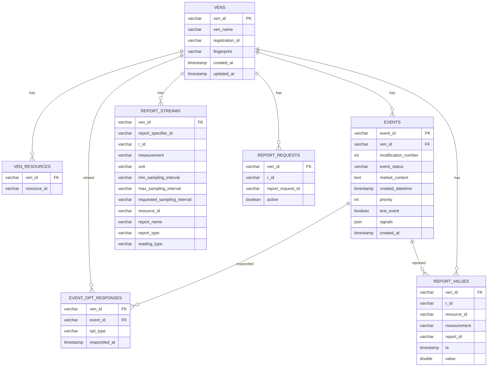

# openleadr チュートリアル

## setup

```bash
pip install openleadr aiomysql python-dotenv
pip uninstall -y pyOpenSSL
pip install "pyOpenSSL<24.3"
```


## ER図


```mermaid
erDiagram
    VENS {
        varchar ven_id PK
        varchar ven_name
        varchar registration_id
        varchar fingerprint
        timestamp created_at
        timestamp updated_at
    }

    VEN_RESOURCES {
        varchar ven_id FK
        varchar resource_id
        %% PK(ven_id, resource_id)
    }

    EVENTS {
        varchar event_id PK
        varchar ven_id FK
        int modification_number
        varchar event_status
        text market_context
        timestamp created_datetime
        int priority
        boolean test_event
        json signals
        timestamp created_at
    }

    EVENT_OPT_RESPONSES {
        varchar ven_id FK
        varchar event_id FK
        varchar opt_type
        timestamp responded_at
        %% PK(ven_id, event_id)
    }

    REPORT_STREAMS {
        varchar ven_id FK
        varchar report_specifier_id
        varchar r_id
        varchar measurement
        varchar unit
        varchar min_sampling_interval
        varchar max_sampling_interval
        varchar requested_sampling_interval
        varchar resource_id
        varchar report_name
        varchar report_type
        varchar reading_type
        %% PK(ven_id, r_id)
    }

    REPORT_REQUESTS {
        varchar ven_id FK
        varchar r_id
        varchar report_request_id
        boolean active
        %% PK(ven_id, r_id)
    }

    REPORT_VALUES {
        varchar ven_id FK
        varchar r_id
        varchar resource_id
        varchar measurement
        varchar report_id
        timestamp ts
        double value
        %% PK(ven_id, r_id, ts)
    }

    %% リレーション
    VENS ||--o{ VEN_RESOURCES : "has"
    VENS ||--o{ EVENTS : "has"
    VENS ||--o{ REPORT_STREAMS : "has"
    VENS ||--o{ REPORT_REQUESTS : "has"
    VENS ||--o{ REPORT_VALUES : "has"
    EVENTS ||--o{ EVENT_OPT_RESPONSES : "responded"
    EVENTS ||--o{ REPORT_VALUES : "reported"
    VENS ||--o{ EVENT_OPT_RESPONSES : "related"

```
