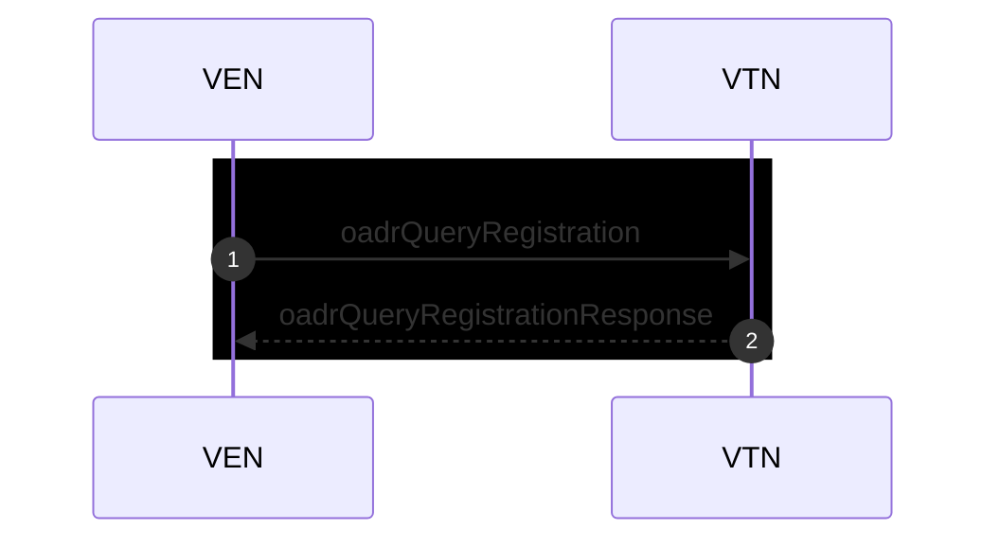
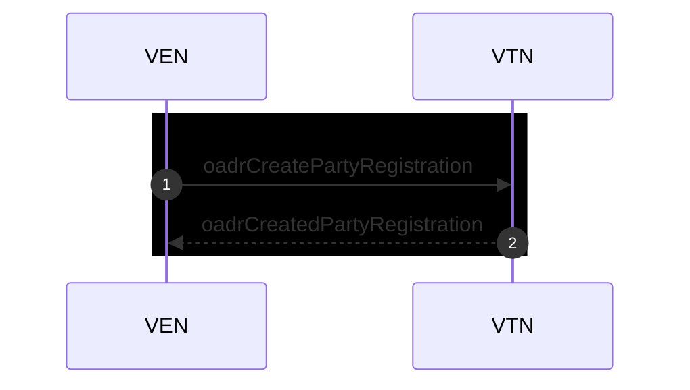

# シーケンス図

| フェーズ             | OpenADR メッセージ                                             |      方向 | OpenLEADR（VTN）の実装/フック                                                       | 戻り値・役割（要点）                                                                                                                                                  |
| -------------------- | -------------------------------------------------------------- | --------: | ----------------------------------------------------------------------------------- | --------------------------------------------------------------------------------------------------------------------------------------------------------------------- |
| 登録                 | `oadrQueryRegistration` → `oadrCreatedPartyRegistration`       | VEN → VTN | `on_query_registration(payload)`                                                    | VTN の対応プロファイルやトランスポート情報を返す（OpenLEADR が生成）。([openleadr.org][1])                                                                            |
| 登録                 | `oadrCreatePartyRegistration` → `oadrCreatedPartyRegistration` | VEN → VTN | `on_create_party_registration(registration_info)`                                   | 受理時は `(ven_id, registration_id)` を返す。OpenLEADR が `oadrCreatedPartyRegistration` を返送。([openleadr.org][1])                                                 |
| イベント取得         | `oadrPoll` → `oadrDistibuteEvent`                              | VEN → VTN | **既定：内部キュー**／任意で `on_poll(ven_id)`                                      | 既定は内部キューから自動で `oadrDistributeEvent` 等を返す。手動運用時はここでメッセージ種とペイロードを返す。([openleadr.org][2])                                     |
| イベント取得         | `oadrRequestEvent`                                             | VEN → VTN | （必要時）`on_request_event(...)`                                                   | 要求に応じてイベントを返送（`oadrDistributeEvent`）。サポートは v0.5.13 以降。([openleadr.org][3])                                                                    |
| イベント配信         | `oadrDistributeEvent`                                          | VTN → VEN | `server.add_event(..., callback=...)`                                               | イベント送出。VEN 応答（`oadrCreatedEvent`）時にコールバック or `on_created_event` が呼ばれる。([openleadr.org][2])                                                   |
| イベント応答         | `oadrCreatedEvent`                                             | VEN → VTN | `on_created_event(ven_id, event_id, opt_type)` **または** `add_event` の `callback` | VEN の optIn/optOut を受領。v0.5.10 で(ven_id, event_id, opt_type) 署名に確定。([openleadr.org][3])                                                                   |
| レポート申告         | `oadrRegisterReport`                                           | VEN → VTN | `on_register_report(...)`                                                           | 採用する項目ごとに **(callback, sampling_interval\[, report_interval])** を返す。以降のレポート配送が始まる。([openleadr.org][4])                                     |
| レポート要求（確立） | `oadrCreateReport`                                             | VTN → VEN | （内部処理）                                                                        | VTN が必要なレポート仕様を要求（必要に応じて）。続いて VEN が `oadrCreatedReport` で確立。ハンドラ `on_created_report` がある（v0.5.21 で追加）。([openleadr.org][3]) |
| レポート確立応答     | `oadrCreatedReport`                                            | VEN → VTN | `on_created_report(...)`（必要に応じて）                                            | VTN→VEN の CreateReport への確立応答を受け取るフック。([openleadr.org][3])                                                                                            |
| レポート配送         | `oadrUpdateReport`                                             | VEN → VTN | `on_update_report(data, ...)`（= `on_register_report` で返した callback）           | `(datetime, value)` の反復を受け取り保存等を実施。OpenLEADR が `oadrUpdatedReport` を返す。([openleadr.org][2])                                                       |
| レポート配送 ACK     | `oadrUpdatedReport`                                            | VTN → VEN | \*\*（実装不要）\*\*自動応答                                                        | 受領確認は OpenLEADR が自動で返送。([openleadr.org][4])                                                                                                               |
| レポート取消         | `oadrCancelReport` / `oadrCanceledReport`                      | VTN ↔ VEN | （内部処理／用途に応じて実装）                                                      | 既存レポートの取り消し（必要に応じて）。([openleadr.org][5])                                                                                                          |
| 再登録要求           | `oadrRequestReregistration`                                    | VTN → VEN | `send_response('oadrRequestReregistration', ...)` 等（内部）                        | 必要に応じて再登録を促す（参考）。([openleadr.org][3])                                                                                                                |

[1]: https://openleadr.org/docs/server.html "Server — OpenLEADR 0.5.26 documentation"
[2]: https://openleadr.org/docs/server.html?utm_source=chatgpt.com "Server — OpenLEADR 0.5.26 documentation"
[3]: https://openleadr.org/docs/roadmap.html?utm_source=chatgpt.com "Project Roadmap — OpenLEADR 0.5.26 documentation"
[4]: https://openleadr.org/docs/reporting.html "Reporting — OpenLEADR 0.5.26 documentation"
[5]: https://openleadr.org/docs/?utm_source=chatgpt.com "OpenLEADR 0.5.26 documentation"
